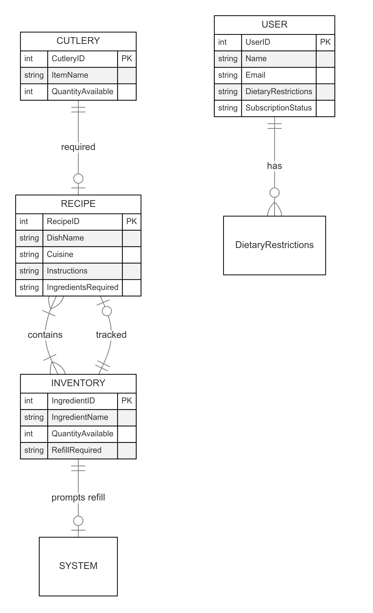

# MasterChef Bot - Operations Planning & Control

Welcome to the **MasterChef Bot** documentation. Here, you will find details about operations planning and control.

## **Contents**
- [Bill of Materials (BOM)](docs/bom.md)
- [Flowchart](docs/flowchart.png)
- [Entity-Relationship Diagram (ER Diagram)](docs/er-diagram.png)
- [UML Class Diagram](docs/uml-diagram.png)

## **1. Bill of Materials (BOM)**
[Click here for BOM details](docs/bom.md)

## **2. Flowchart**

    

## **3. Entity-Relationship Diagram**

    

## **4. UML Class Diagram**

    

---

